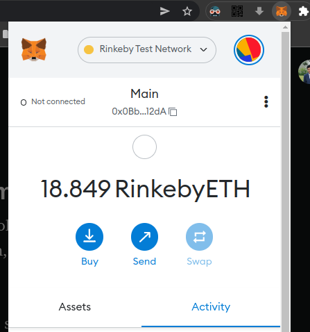
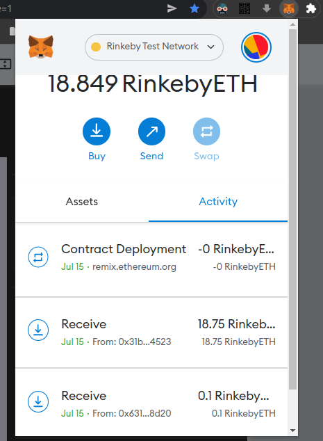
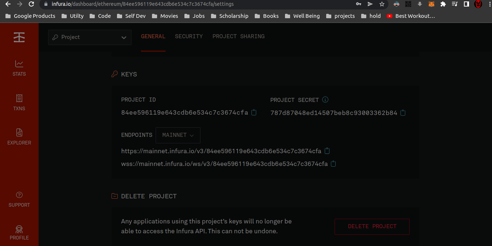

<h1 align="center">Refund by location smart contract</h1>
<div>

<a href="https://github.com/Abel-Blue/refund-smart-contract/network/members"></a>
<a href="https://github.com/Abel-Blue/refund-smart-contract/pulls"></a>
<a href="https://github.com/Abel-Blue/refund-smart-contract/issues"></a>
<a href="https://github.com/Abel-Blue/refund-smart-contract/graphs/contributors"></a>
<a href="https://github.com/Abel-Blue/refund-smart-contract/blob/main/LICENSE"></a>
</div>

</br>


<hr>

## Introduction

> <p>A program or application stored and run on the blockchain network is referred to as a decentralized application (dApp).</p>

 <p>The refund by location smart contract is aimed to be used when one party, for example, an employer, agrees to pay another party, for example, an employee, for being present in a certain geographic area for a certain duration. The employee's phone sends its GPS location to a smart contract at a certain interval. Based on the pre-agreed contract codified in an Ethereum smart contract, a cryptocurrency payment is executed when all the agreed conditions are met.

If at any point, the GPS sensor indicates that an employee is outside the range of the agreed GPS area, the contract state will be updated to indicate that it is out of compliance.

Ethereum has two types of accounts:

</p>

> 1. Externally Owned Accounts (EOA): These accounts are used by nodes to send or receive Ether. These accounts are associated with a private key.
> 2. Contract Accounts: These accounts hold and execute smart contract code. Unlike EOAs, contract accounts do not have a private key.

## Setting up MetaMask Wallet

To use MetaMask wallet:

- Install MetaMask extension on the desired web browser.
- Setup Account and Test network (in this project, Rinkeby test network is used)
- Load funds into Rinkeby account address by using crypto faucets.



> Then Deploying Smart Contract via Remix IDE. After compiling and deploying the Smart Contract by approving transactions in MetaMask wallet, it will show up on our wallet activity status that the contract is deployed successfully.



## Infura

<p>The mobile application (or dApp) is linked to the smart contract using the Infura API. It serves as a Gateway and manages all requests made to the smart contract. An account must must be created in order to access the Infura API. To view the statistics of requests made to a smart contract, a project must first be built for this application.</p>



## Flutter Mobile Application

<p>After installing the application on the mobile device of the employee, the user interface will look as shown below.</p>


# <a name='Flutter App Installation guide'></a>Flutter App Installation guide

### <a name='conda'></a>IOS

```bash
git clone https://github.com/Abel-Blue/refund-smart-contract.git
cd refund-smart-contract
cd flutterdapp
flutter pub get
flutter build ios --no-sound-null-safety
flutter install-local --platform ios
```

### <a name='conda'></a>Android

```bash
git clone https://github.com/Abel-Blue/refund-smart-contract.git
cd refund-smart-contract
cd flutterdapp
flutter pub get
flutter build apk --no-sound-null-safety
flutter install
```

### <a name='conda'></a>Run flutter App on debug mode

- First connect your device using USB cable.

```bash
git clone https://github.com/Abel-Blue/refund-smart-contract.git
cd refund-smart-contract
cd flutterdapp
flutter pub get
flutter run --no-sound-null-safety
```

<hr>

# <a name='license'></a>License

[License](https://github.com/Abel-Blue/refund-smart-contract/blob/main/Licence)
